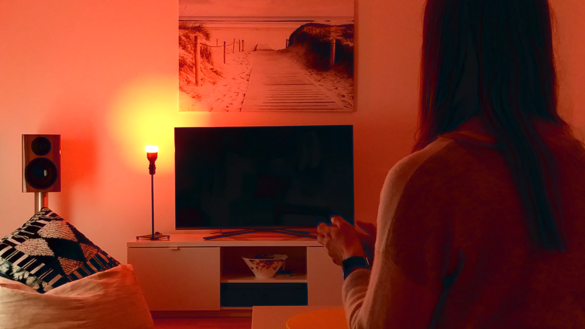
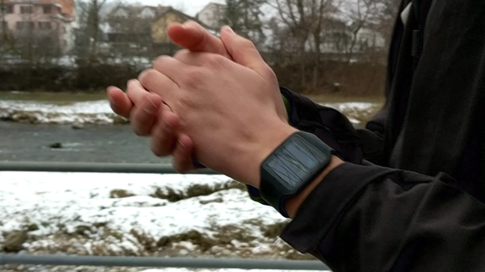

# GestEar

Repository containing the code for the ISWC'19 paper: "GestEar: Combining Audio and Motion Sensing for Gesture Recognition on Smartwatches"

Contact by [email](mailto:vincent.becker@inf.ethz.ch).

The goal of this project is to classify hand gestures on a smartwatch based on the emitted audio and IMU data. Our classifier distinguishes eigth gestures: snapping left, snapping right, knocking left, knocking left twice, knocking right, knocking rith twice, clapping, and clapping right twice.

You can use a Android Wear smartwatch with a microphone and IMU sensor. We used a Sony smartwatch 3. 

### Possible applications
We built different applications around our classification system for device control. For example, you can control different smart devices, such as a sound system, a lamp, or a mobile phone. 

You could also use it to unlock your smartphone. 

## Gathering your own data
Collect gesture data from a smartphone, and place the IMU data in csv-files (a separate file per sensor: accelerometer, gyroscope, and magnetometer) and store the  audio sample as a wav-files and place the four files in a path `participantID/sessionID/GestureName/`. You can moreover gather audio noise samples (as wav-files), and additional IMU samples and provide them to the preprocessing script in the next step. 
  
## Running the experiments.
All the necessary script for preprocessing and running the experiments are in the `learning` project. 
First, use the `preprocessing` script to extract the samples. Then you can run different experiments such as cross validation on all data or a cross validation across participants using the evaluaiton script. If you want to try different models, replace the model loading function with any model form the `networks2` package. If you want to save a model, use the `train_on_all` function and set the `validate`-option to false, which will save the model at the end of the training process. You can then convert the saved version to a tflite-version using the `utility`-script.  

## Running the Android application
Place the tflite-model in the assets folder of the android project and install the app on a smartwatch. The app will run the classifier and show the results on the screen. 
